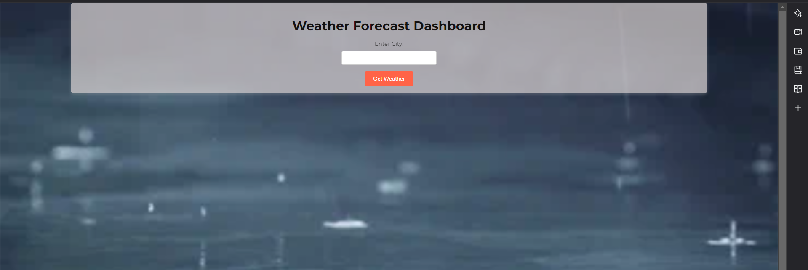
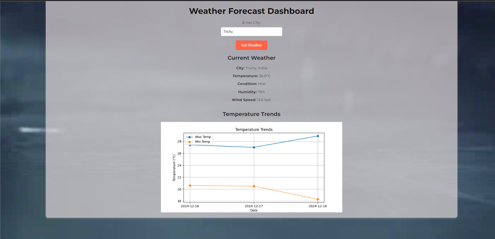

# Flask Weather Application 🌦️

This repository contains a weather application built using **Flask** that fetches real-time weather data for a user-provided location. The app uses the **WeatherAPI** to display current weather and a 3-day forecast, along with a temperature trend chart. The application is styled for a clean user experience and can be deployed to **Vercel** for hosting.

---

## Features 🚀

- **Search Weather by Location**: Enter a city name to fetch weather details.
- **Real-Time Weather Information**: Displays temperature, condition, humidity, wind speed, and more.
- **3-Day Forecast with Charts**: Includes a plot of temperature trends (max and min) for the next 3 days.
- **Error Handling**: Informs users when data retrieval fails.
- **Responsive Design**: User-friendly interface with styled weather data and charts.

---

## Tech Stack 💻

- **Backend**: Flask, Python
- **Frontend**: HTML, CSS, Jinja2 templates
- **Weather API**: [WeatherAPI](https://www.weatherapi.com/)
- **Deployment**: Vercel

---

## Prerequisites 📋

Before running or deploying the application, ensure the following:

1. **Python 3.7+** installed on your machine.
2. Install required dependencies listed in the `req.txt` file.
3. Sign up at [WeatherAPI](https://www.weatherapi.com/) to get your **API key**.

---

---

## Getting Started 🛠️

### 1. Clone the Repository

git clone https://github.com/your-username/flask-weather-app.git
cd flask-weather-app

# Create a virtual environment (optional)
python -m venv venv
source venv/bin/activate  # On Windows: venv\Scripts\activate

# Install dependencies
pip install -r req.txt

### 3. Configure the WeatherAPI Key
Replace the placeholder API key in api/weather.py with your WeatherAPI key:

API_KEY = "your-weatherapi-key-here"

### 4. Run the Flask Application Locally

Run the application in development mode:

python api/weather.py

## Deploying to Vercel 🌐
# 1. Install Vercel CLI
Ensure that you have the Vercel CLI installed globally on your system. If not, install it using npm:

npm install -g vercel
# 2. Login to Vercel
Authenticate with your Vercel account:

vercel login

# 3. Deploy the Application
From the root of your project directory, deploy the application:

vercel
During the deployment process, Vercel will:

Detect the vercel.json file for configuration.
Deploy the Flask app using the api/weather.py file.
# 4. Access Your Deployed App
After deployment, Vercel will provide you with a live URL for your app. You can share this link or visit it in your browser.

### Example Screenshots 🌟
## Homepage

## Weather Data

### API Endpoints 🌐
## GET /: Displays the home page with the search form.
## POST /: Processes the location entered by the user, fetches weather data, and renders the results.

### Troubleshooting 🛠️
Error: ModuleNotFoundError
Ensure all dependencies are installed using pip install -r req.txt.

Weather Data Not Displaying
Check your WeatherAPI key and ensure it is active and valid.

### License 📜
This project is licensed under the MIT License. See the LICENSE file for details.

### Acknowledgments 🙏

WeatherAPI for providing weather data.
Flask for being a lightweight and easy-to-use Python framework.
Matplotlib for creating weather trend charts.

